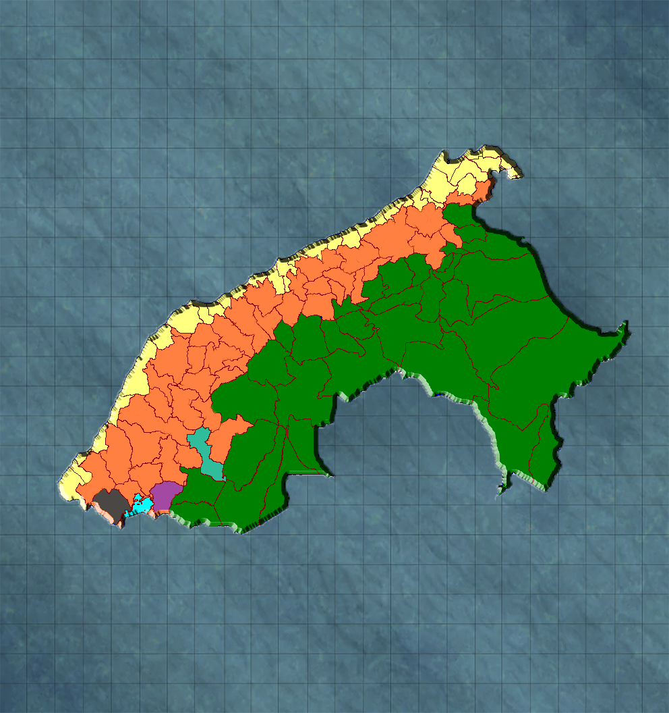

+++
title="Geography"
+++

## Terrain
 **Yellow:** Coastal region. Dry areas and lots of sand, slight mists and sprinkle-like rain. Deserts are rare but not uncommon in these lands, however the land has a tendency to be flat and fishes are plentiful around ocean-adjacent zones. However, it appears there are a lot of "ex-coworkers" who have taken residence in these parts who might remember you and might not be too fond of seeing you...Or perhaps they are happy they can finally repay you for their “years of service”.

**Orange:** Mountains fill this third of the continent, the ground at their base extremely fertile and once perfect for agriculture, as well as the rearing of llamas, alpacas, sheep, guinea pigs and cows. Ruins are not uncommon, for the hero's light ensured any construction that sported the demon’s crest to be reduced to nothing but rubble . Deserts are extremely common in these lands, however dig a bit further and you might be surprised with what lies beneath. Be careful because not only are there creatures hiding within the sand, but also those that have taken to the skies as their domain. 

**Green:** Virginal jungle spreads around you, the sheer amount of flora and fauna that occupy this region is unreal, however none of it could be really considered "natural" in the human sense. Megafauna, creatures from ages past, and many other things inhabit the unexplored jungle, however fruits and vegetables are plentiful-As plentiful as the amount of competition you’ll be facing.

## Polities
**Purple:** Dionaea, ruled by Resilius  
**Black:** Knox, ruled by Asuka  
**Turquoise:** Sparveria, ruled by Churki

